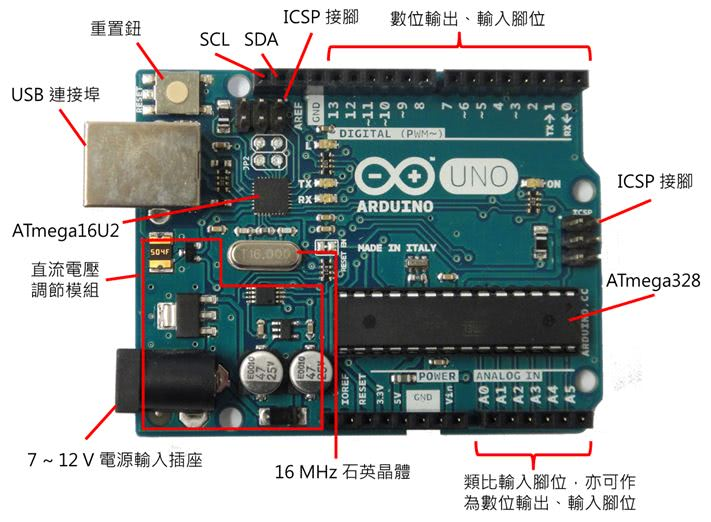
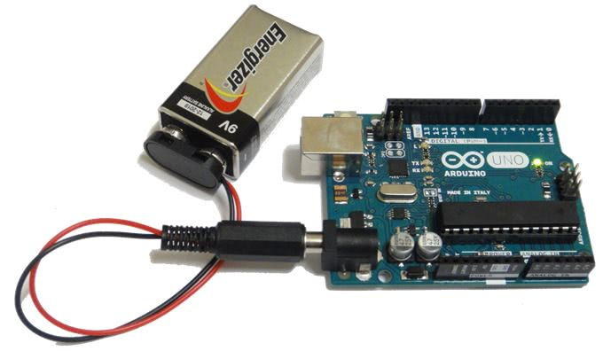

# Arduino UNO 版簡介

---
## 基本供電
Arduino UNO的運作直流電壓為5V，請以正常方式供電避免損壞，以及使其正常運作。

透過USB(TYPE-B)必須是給予5V的電壓，連接電腦時會提供5V、500mA的電源。 

如果是透過藍芽或其他方式提供資料，同樣必須是5V電壓，但電流至少2A以上

---

UNO可以透過2.1mm的電源插座供電，限制為6~20V，但建議給予7~12V的直流電，低於7V的話5V腳位可能會電壓不足，高於12V電壓調節模組可能過熱而損壞，建議使用9V電池。

---

## 數位輸出、輸出腳位
數位訊號腳位可以輸出高電位5V與低電位0V的數位訊號，也可以接受數位訊號，編號為D0~D13(Digital)。 
編號旁有波浪圖案(~)，代表有PWM功能(Pulse Width Modulation)，可以模擬類比訊號。

### D0、D1
兩腳位較為特殊，D0標示RX(Receiver)、D1標示TX(Transmitter)，這兩腳位用於序列埠傳送，且與USB序列埠連接，使用USB傳送資料時，應避免使用D0、D1腳位

### D13
D13腳位連接控制板上標示L的LED，可以用來檢查控制板是否正常。

---

## 類比輸入腳位
可以接收類比訊號，但不能輸出，如果要輸出類比訊號則需利用有PWM功能的數位腳位。

控制板上ATmega328內建類比數位轉換器(Analog to digital converter，簡稱ADC)，會將0~5V轉換成0~1023的數值。

其實也可以做為數位輸出、輸入腳位使用。